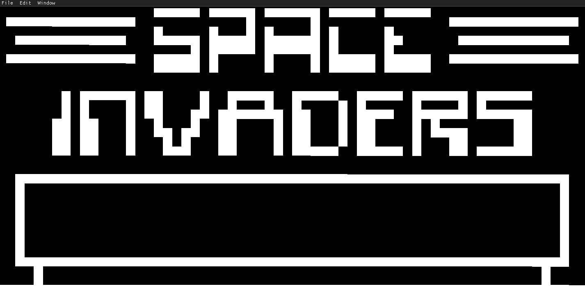
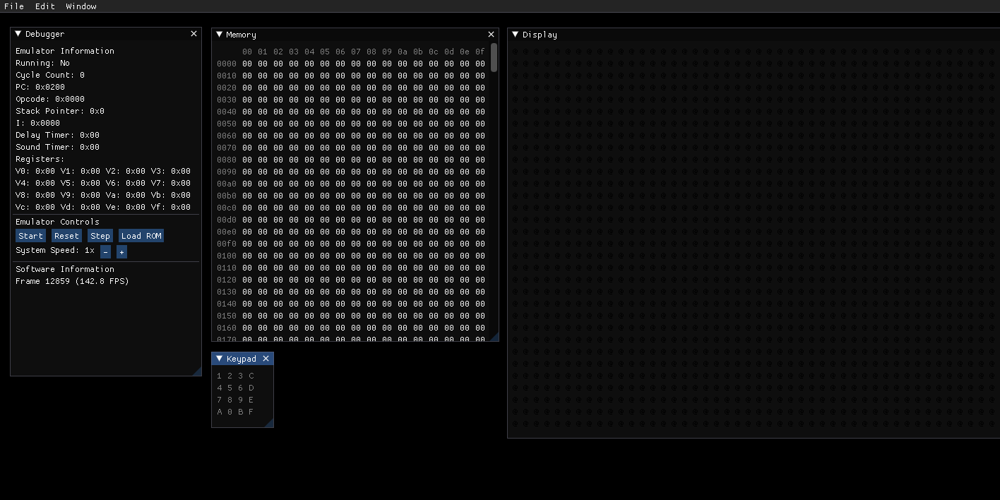

# CHIP-8 Emulator with GUI & Debugging Tools

    
    

## About
I wrote a CHIP-8 emulator in August of 2020, which was my first endeavour into emulation.
You can check out the source code for it [here](https://github.com/mdibble/chip8-emu) if you'd like.
That emulator was written in Rust using SDL2 as the graphics backend.
I've been interested in learning a more complex graphics API, and I thought remaking an old project from the ground-up using OpenGL would be a great intro. 
This time around I decided to use C++ as it seems to be a better choice for learning the ropes of OpenGL, although there are Rust bindings available.
It also utilizes [Dear ImGui](https://github.com/ocornut/imgui) for debugging tools and such.

## Features
* Emulator backend that passes all test ROMs
* Fully-functional GUI that interacts with the emulator
* A large suite of debugging tools
* Loading ROMs via OS-specific file menus (supports Windows and Linux)

## Running Locally
You can compile the source yourself using CMake using a process along these lines:
1. Create the build information `Example: $ cmake -S . -B ./build/`
2. Build the project `Example: $ cmake --build ./build/`
3. Run the executable `Example: $ ./build/Debug/chip8-imgui`

## To Do
* System sound
* Save states
* Ability to change foreground and background colours
